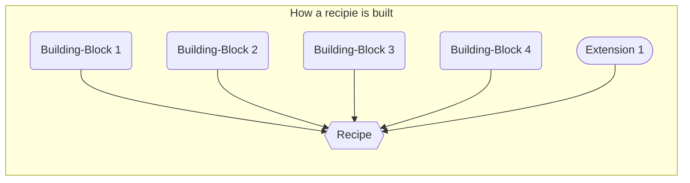

```text
SPDX-License-Identifier: Apache-2.0
Copyright (c) 2022 Intel Corporation
```
# Smart Edge solution composition  
- [Smart Edge solution composition](#smart-edge-solution-composition)
  - [Objective](#objective)
  - [Audience](#audience)
  - [Recipe](#recipe)
    - [Examples of Recipe](#examples-of-recipe)
  - [Building-block](#building-block)
    - [Examples of Building-block](#examples-of-building-block)
  - [Extension](#extension)
    - [Examples of Extension](#examples-of-extension)
  - [Concept: Recipe, Building-block and Extension](#concept-recipe-building-block-and-extension)
  - [Implementation](#implementation)
    - [Tagging Schema for Experience Kit Schema](#tagging-schema-for-experience-kit-schema)
      - [Example of how to document experience kit in the Ansible](#example-of-how-to-document-experience-kit-in-the-ansible)
    - [Tagging Schema for Roles in the Experience Kit](#tagging-schema-for-roles-in-the-experience-kit)
      - [Example of how to document roles in the Ansible](#example-of-how-to-document-roles-in-the-ansible)
  - [Report generator](#report-generator)

## Objective 

This document provides an overview of how Smart Edge solution is organized and developed using Building-Blocks, Extensions and Recipes. This is mostly a development and organization concept to help with architecture, design, code and documentation reuse and modularity. This document is not intended for product marketing although its contents might be used/referred.  

## Audience  

This document is intended for Intel Smart Edge Development and Validation engineers. 

## Recipe

A well-defined and opinionated set of core components and/or Extensions that are integrated on a commercial hardware to form a Commercial/Open Smart Edge product in the service of an end user experience. 

### Examples of Recipe
 1. Intel® Smart Edge Node software and Intel® Smart Edge Controller software
 2. SASE Experience Kit 
 3. Developer Experience Kit
 4. Private Wireless Experience Kit

## Building-block
Cloudnative Components that are CNCF certified and 3gpp compliant where applicable that will be used to build Smart Edge Products. They are truly reusable across open and commercial and exist to serve Open and Commercial. 
Not all the Building-block needs to be used to build a specific Smart Edge product (Recipe)

Extension is typically represented as an ansible role. 

> Note: Roles for an Experience Kit is typically found in ``single_node_network_edge.yml`` and/or ``network_edge.yml`` along with the yml files in "playbook" directory in each Experience Kit. 

### Examples of Building-block
  1. Kubernetes core
  2. Virtualization
  3. Networking service (CNIs)
  4. Service Mesh	
  5. Observability
  6. Zero trust Security
  7. Dataplane
  8. Accelerator orchestration 
  9. Runtime service (CRIs)
  10. Storage Service (CSIs)
  11. Registry Service
  12. App Life Cycle management Services
  13. 3rd party 5G Core CNF
  14. 3rd party 5G RAN CNF
  15. Secure Access Service (SASE configuration and orchestration)
  16. Secure Access CNFs (SASE CNFs)
  17. Reference Applications
  18. Energy Efficiency services
  19. Authentication and Authorization
  20. 5G Core Cellular Service
  21. 5G RAN Cellular Service
  22. Operating System service 
  23. Platform service (e.g. driver, BIOS/Firmware)  
  24. Provisioning service
  25. Multi-tenancy service

## Extension
A component that is built for purpose for a given Smart Edge Product and that can not be highly re-used across smart edge products and serves a specific function. 

Extension is typically represented as an ansible role. 

> Note: Roles for an Experience Kit is typically found in ``single_node_network_edge.yml`` and/or ``network_edge.yml`` along with the yml files in "playbook" directory in each Experience Kit. 

### Examples of Extension
  1. Vendor specific 5G Core license manger 
  2. Vendor specific 5G RAN license manger 
  3. Vendor specific platform manger 

## Concept: Recipe, Building-block and Extension




## Implementation 

Every Smart Edge experience kit Ansible will have the following tagging schema defined which will be maintained and updated 

### Tagging Schema for Experience Kit Schema 

Every experience kit root folder has ``single_node_network_edge.yml`` and ``network_edge.yml``. 
- ``single_node_network_edge.yml``: File represents support for Single node cluster for that experience kit. 
- ``network_edge.yml``: File represents support for multi node cluster for that experience kit. 
  
Every Experience kit will support a Single node edge cluster or Multi node edge cluster or both. Below is the schema for the Experience Kit that will be updated and maintained. 

```
# Name: <Name of the Recipe/Experiance kit>
# Type: <Recipe>  
# Source: <path to public repo>
# Supported: <Yes/No> (if this single_node_network_edge.yml or network_edge.yml is valid for this experiance kit) 
# Description: <One line description of the experiance kit>

```

#### Example of how to document experience kit in the Ansible

In the ``single_node_network_edge.yml`` of the Developer Experience kit. 
```
# Name: Developer Experience Kit (DEK)
# Type: Recipe 
# Source: https://github.com/smart-edge-open/open-developer-experience-kits
# Description: The Developer Experience Kit lets you easily install and instantiate an Intel® Smart Edge Open edge cluster.
# Supported: Yes
```

### Tagging Schema for Roles in the Experience Kit

```
# Name: <Name of the component described in the role>
# Type: <Building-Block>, <Extension>  
# Domain: <one among the 23 building-blocks listed in the above section>
# Source: <path to public repo>, <internal if component is binary>
# IP status: <SE-Create>, <Adopt-Enhance>, <Reuse>, <Fork>
# Description: <One line description of the component>
```

#### Example of how to document roles in the Ansible 

Grafana

```
# Name: Grafana
# Type: Building-Block
# Domain: Observability
# Source: https://github.com/grafana/grafana
# IP status: Reuse
# Description: Allows you to query, visualize, alert on and understand your metrics no matter where they are stored.
```

5G Core Cellular service

```
# Name: 5G Core Cellular service
# Type: Building-Block  
# Domain: 5G Core Cellular Service
# Source: Internal
# IP status: SE-Create
# Description: 5G Core Cellular services deployed on the Smart Edge controller that supports Smart Edge defined 5G Core configuration REST API on the north bound and gRPC on the south bound. 
```

5G Core license manger

```
# Name: Druid 5G Core license manger
# Type: Extension
# Domain: Vendor specific 5G Core license manger
# Source: Internal
# IP status: SE-Create
# Description: Vendor specific 5G Core license manager service that is deployed on the Smart Edge controller.
```

## Report generator  

``yaml_parser.py`` located in the Developer Experience Kit is used to generate a csv file for a given Recipe (Experience Kit). Recipe section of the tagging will be used for the output csv file name. The csv file will contain the building-blocks and extensions that make up the recipe.

usage: 
```
python3 yaml_parser.py
```
To specify root directory of Recipe (Experience Kit) use ```-in``` option
```
python3 yaml_parser.py -in /experience/kit/directory
```

To combine multiple csv files into one use ```-c``` option combined with:
 -  ```-in``` to specify directory 
```
python3 yaml_parser.py -c -in /experience/kits/
```
 -  ```-f``` to specify file, or files
```
python3 yaml_parser.py -c -f /experience/kits/file1.csv /experience/kits/file2.csv
```


